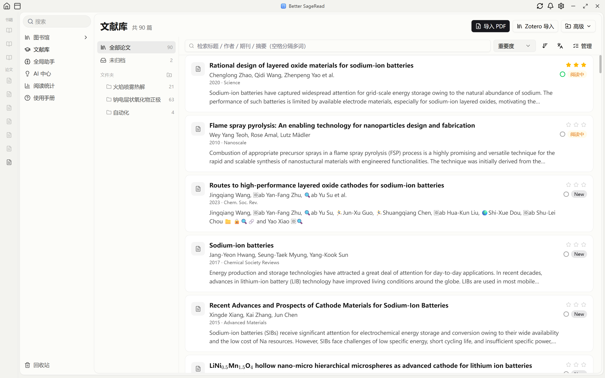
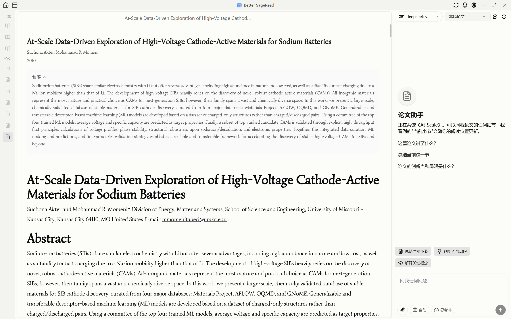
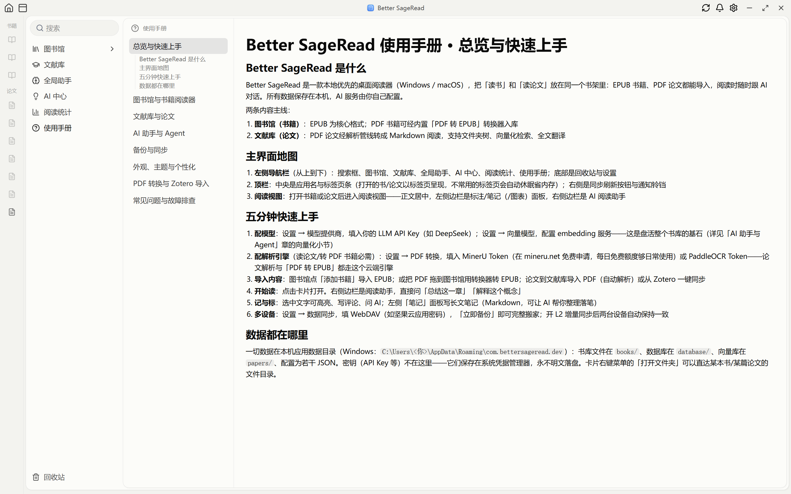
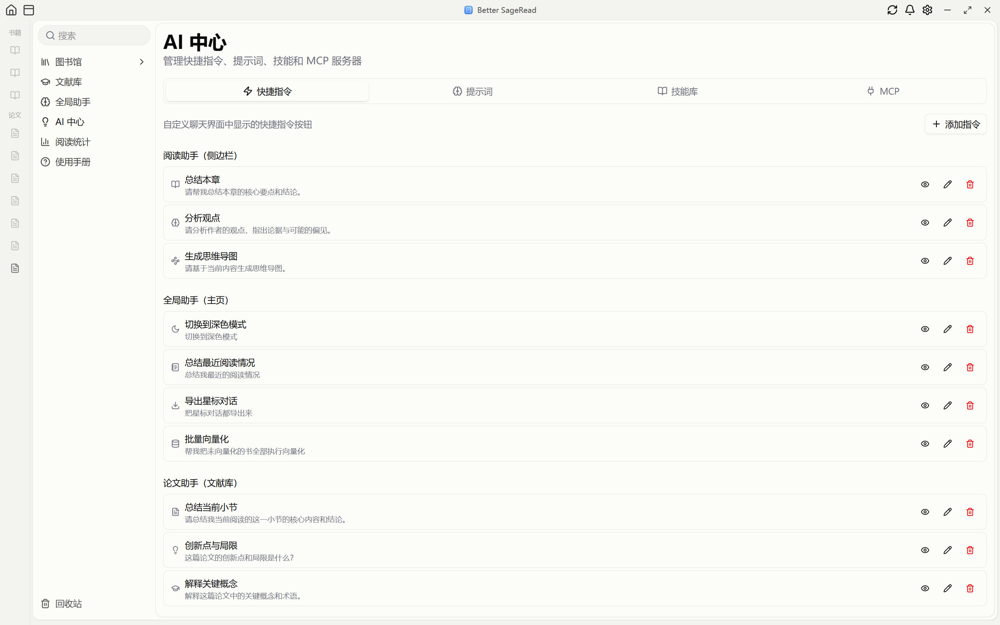

<div align="center">

# Better SageRead

**本地优先的 AI 阅读器：EPUB 书籍与 PDF 论文同架，阅读时随时与 AI 对话**

[](LICENSE)  [](https://github.com/Feplus2/better-sageread/releases/latest)

</div>

<br/>

> **渊源与致谢**：Better SageRead 基于 xincmm 的开源项目 [SageRead](https://github.com/xincmm/sageread) 发展而来，原作者奠定了核心框架，在此致谢。详见 [NOTICE](NOTICE)。

Better SageRead 把「读书」和「读论文」放进同一个书架：EPUB 书籍即导即读，PDF 论文经解析管线转为排版精良的 Markdown。三个 AI 助手各守一个场景，整个书库向量化后变成 AI 可检索、可引用的知识底座。所有数据存在本机，密钥在系统凭据管理器，AI 服务完全由你自己配置。

---

## 🎬 功能展示









---

## ✨ 核心特性

### 📖 阅读

- **书籍**：EPUB 为核心，分页/滚动双模式、字体字号自定义、目录跳转、阅读时长统计
- **论文**：PDF 经内置管线（MinerU VLM / PaddleOCR）解析为 Markdown——公式 KaTeX 渲染、大图光栅化重裁保持完整、图注/表注锚点速跳面板、整篇中译对照
- **PDF 转 EPUB**：扫描版书籍一键转换入库
- **标注与笔记**：划线高亮（多色/多笔触）、评论、长文 Markdown 笔记面板（AI 可直接帮你整理落笔），位置 tag 按章节归类
- **Zotero**：配置 API Key 后扫描 Zotero 库，按 collection 一键批量导入

### 🤖 AI 与 Agent

- **三个助手各司其职**：阅读助手（当前书）、论文助手（当前论文 + 跨论文检索）、全局助手（导入/整理/转换/备份/设置——图形界面能做的它都能做）
- **向量化语义检索**：配置 embedding 服务后，整个书库按「意思」检索；AI 做总结、比对、报告、写作时，结论都有你库里的原文证据加持
- **技能系统**：兼容 Claude Code SKILL.md 生态，可新建/导入/启停，按作用域挂载
- **MCP 扩展**：远程 HTTP/SSE 与本地 stdio 双传输，内置开源市场清单一键安装
- **密钥保管箱**：API Key 统一存系统凭据管理器，配置中以 `{{secret:名称}}` 引用——不明文落盘、不进备份、模型只见占位符
- **安全三档**：工作区外的读/写/命令执行弹确认卡由你裁决；网络外发始终确认
- **对外开放**：配套独立项目 sageread-mcp（MCP server，另行开源），你更顺手的 Agent 客户端（Claude Desktop 等）也能从外部检索这个向量库

### ☁️ 备份与同步

- **L1 完整备份**：WebDAV（如坚果云）整包搬家——数据库、书籍文件、向量库、配置、Agent 工作区一个不少，内容寻址去重，日常备份只有几 MB
- **L2 增量同步**（BETA）：多设备阅读进度、对话、笔记、设置自动保持一致
- **密钥不上云**：换机后重填一遍 Key 即恢复全部能力

### 🎨 个性化

- Typora 式 CSS 全局主题（内置 5 套，含视频壁纸主题），支持自制主题（[主题开发指南](docs/THEMING.md)）
- 阅读区背景：纯色 / 照片场景 / 自定义图片，遮罩浓度可调
- 字体管理：导入自己的 .woff2 用于书籍正文

---

## 🚀 快速开始

**下载安装**：到 [Releases](https://github.com/Feplus2/better-sageread/releases/latest) 下载 Windows 安装包（NSIS `setup.exe` 或 MSI）。

**四项配置**（全部在设置页内完成）：

1. **模型提供商**：填 LLM API Key（如 DeepSeek）
2. **向量模型**：配置 embedding 服务——盘活书库的基石
3. **PDF 转换**：填 MinerU Token（[mineru.net](https://mineru.net/apiManage/token) 免费申请；解析论文、PDF 转 EPUB 都靠它）
4. **（可选）数据同步**：填 WebDAV 开备份；**（可选）Zotero**：填 API Key 开同步导入

详细说明见应用内「使用手册」（左侧导航栏）。

> ⚠️ 目前仅发布 Windows 版。macOS 源码可构建，但正式版暂缓（无 Apple 签名 + 转换器缺 mac 构建）。

---

## 📚 文档

- **使用手册**：应用内「使用手册」栏目（AI 助手也能检索它回答你的问题）
- **开发者 wiki**：[`wiki/`](wiki/00-index.md)——架构、数据模型、同步协议、Agent 系统、转换管线、开发工作流
- **主题开发**：[`docs/THEMING.md`](docs/THEMING.md)

## 🛠️ 从源码构建

```bash
# 前置：Node 22+、pnpm 11、Rust stable；Windows 需 WebView2
pnpm install
pnpm dev        # 开发模式
pnpm build      # 出安装包（packages/app/src-tauri/target/release/bundle/）
```

更多开发细节见 [wiki/06 开发工作流](wiki/06-dev-workflow.md)。

## 📄 许可证

[AGPL-3.0](LICENSE)。测试用论文 fixture 为 CC-BY 4.0 开放获取论文（`fixtures/papers/akter2026atscale/README.md` 附署名）。
