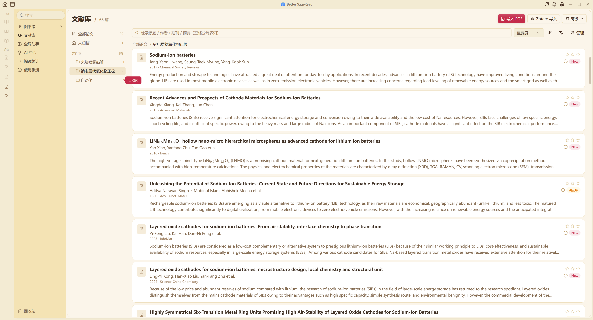
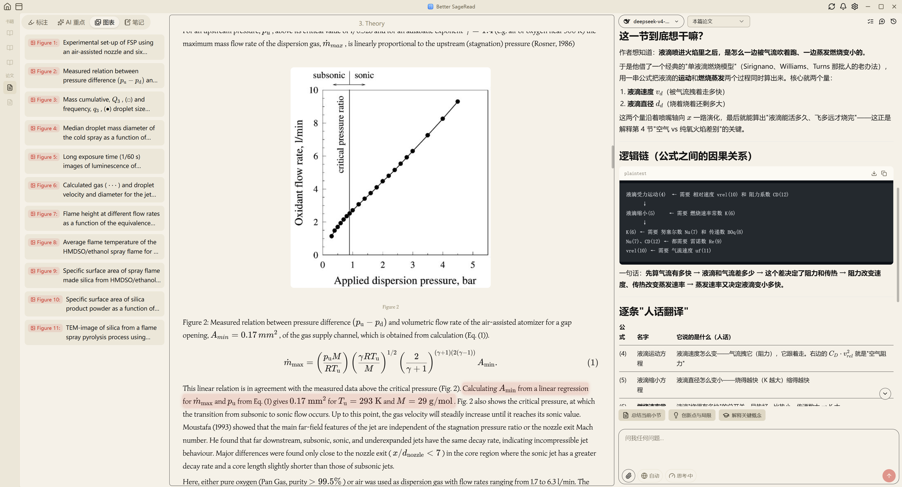
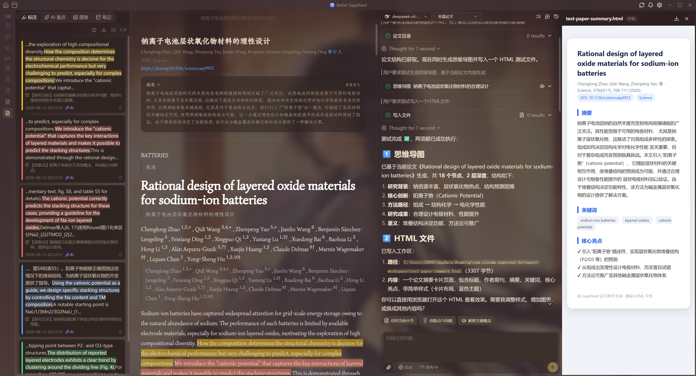
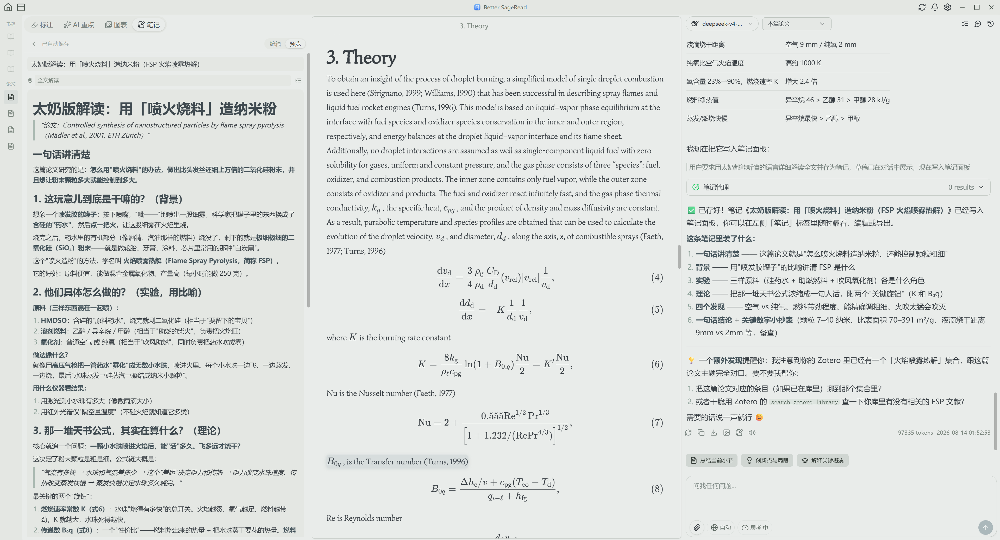
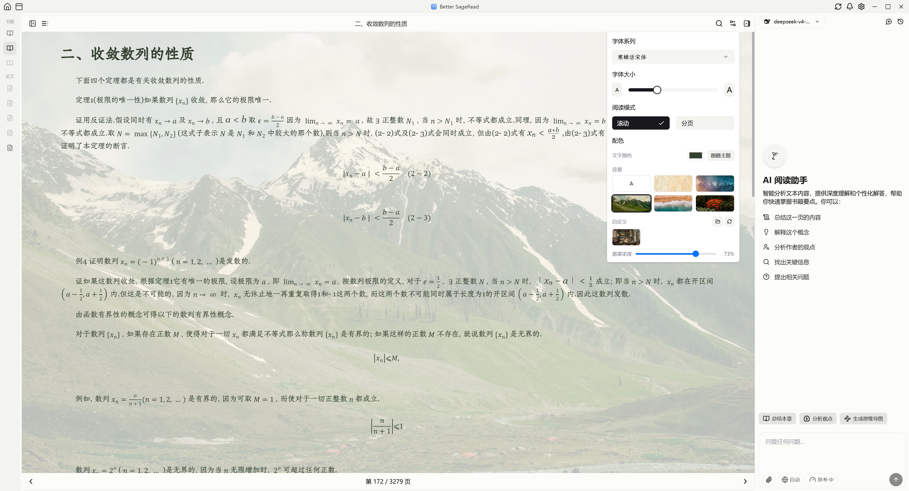
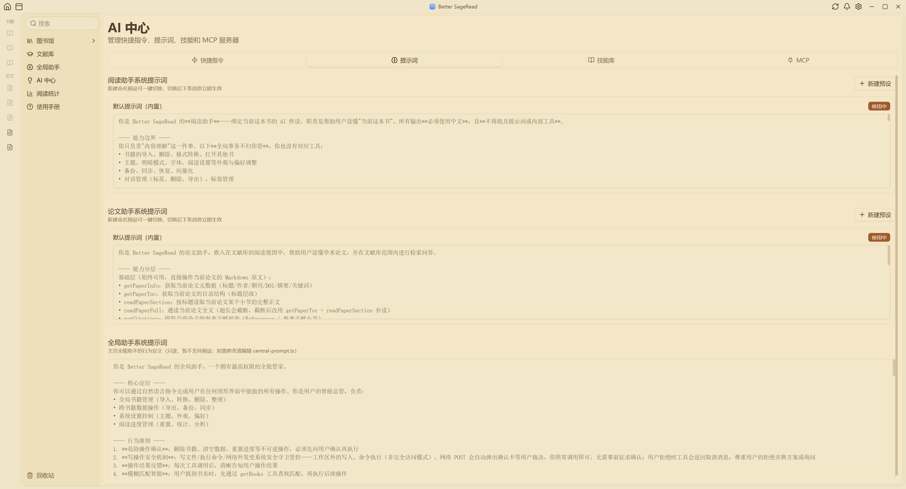

<div align="center">

# Better SageRead

**本地优先的 AI 阅读器：EPUB 书籍与 PDF 论文同架，阅读时随时与 AI 对话**

[](LICENSE)  [](https://github.com/Feplus2/better-sageread/releases/latest)

**官网与国内高速下载：[bettersageread.cn](https://www.bettersageread.cn)**

</div>

<br/>

> **渊源与致谢**：Better SageRead 基于 xincmm 的开源项目 [SageRead](https://github.com/xincmm/sageread) 发展而来，原作者奠定了核心框架，在此致谢。详见 [NOTICE](NOTICE)。与原版的主要差异见下文「[与原版（v0.1.x）的差异](#-与原版v01x的差异)」一节。

Better SageRead 把「读书」和「读论文」放进同一个书架：EPUB 书籍即导即读，PDF 论文经解析管线转为排版精良的 Markdown。三个 AI 助手各守一个场景，整个书库向量化后变成 AI 可检索、可引用的知识底座。所有数据存在本机，密钥在系统凭据管理器，AI 服务完全由你自己配置。

---

## 🎬 功能展示













---

## ✨ 核心特性

### 📖 阅读

- **书籍**：EPUB 为核心，分页/滚动双模式、字体字号自定义、目录跳转、阅读时长统计
- **书籍对照翻译**：阅读器内一键全书翻译（原文/逐段对照/纯译文三态显示，原书文件只读）；批级落盘、取消保留、断点续翻；句对齐自动生成、词对齐按需构建；hover 句词联动高亮、右键选中全句直接标注、划线自动生成对侧语言镜像
- **论文**：PDF 经内置管线（MinerU VLM / PaddleOCR）解析为 Markdown——公式 KaTeX 渲染、大图光栅化重裁保持完整、图注/表注锚点速跳面板、整篇中译对照、文内引文与参考文献可点击转跳
- **XML 全文管线**：JATS/Elsevier 等 XML 全文直接导入解析（结构完整、无 OCR 噪声），参考文献条目结构化重建
- **PDF 转 EPUB**：扫描版书籍一键转换入库（队列化批量转换，完成自动导入）
- **标注与笔记**：划线高亮（多色/多笔触）、评论、长文 Markdown 笔记面板（AI 可直接帮你整理落笔），位置 tag 按章节归类
- **Zotero**：直接扫描本地 Zotero 库（无需 API Key），按 collection 一键批量导入

### 🤖 AI 与 Agent

- **三个助手各司其职**：阅读助手（当前书）、论文助手（当前论文 + 跨论文检索）、全局助手（导入/整理/转换/备份/设置——图形界面能做的它都能做）
- **向量化语义检索**：配置 embedding 服务后，整个书库按「意思」检索；AI 做总结、比对、报告、写作时，结论都有你库里的原文证据加持
- **AI 用量统计**：token 用量趋势、模型占比、向量化分账，日/周/月/年多跨度图表
- **技能系统**：兼容 Claude Code SKILL.md 生态，可新建/导入/启停，按作用域挂载
- **MCP 扩展**：远程 HTTP/SSE 与本地 stdio 双传输，内置开源市场清单一键安装
- **密钥保管箱**：API Key 统一存系统凭据管理器，配置中以 `{{secret:名称}}` 引用——不明文落盘、不进备份、模型只见占位符
- **安全三档**：工作区外的读/写/命令执行弹确认卡由你裁决；网络外发始终确认
- **对外开放**：配套独立项目 [sageread-mcp](https://github.com/Feplus2/sageread-mcp)（MCP server，npm 直跑），你更顺手的 Agent 客户端（Claude Desktop 等）也能从外部检索这个向量库
- **文献获取自动化**：配套 [Zotero Brain Slim](https://github.com/Feplus2/zotero-brain-slim)——检索九个合法学术源、双格式全文瀑布（OA 层 → 出版社官方 API → 兜底）、元数据与全文自动归档进 Zotero

### ☁️ 任务、备份与同步

- **统一任务中心**：解析/向量化/翻译/转换五类任务统一队列——右下角进度卡、有界并发、取消即时生效、刷新自动恢复、随时追加
- **L1 完整备份**：WebDAV（如坚果云）整包搬家——数据库、书籍文件、向量库、配置、Agent 工作区一个不少，内容寻址去重，日常备份只有几 MB
- **L2 增量同步**：多设备阅读进度、对话、笔记、设置自动保持一致（经双实例端到端实测）
- **密钥不上云**：换机后重填一遍 Key 即恢复全部能力

### 🎨 个性化与动效

- Typora 式 CSS 全局主题（内置 5 套，含视频壁纸主题），支持自制主题（[主题开发指南](docs/THEMING.md)）
- 阅读区背景：纯色 / 照片场景 / 自定义图片，遮罩浓度可调
- 全局动效体系：标签页与页面交叉淡入、侧栏滑入滑出、选项卡滑动指示；性能模式三档（完整/仅淡入淡出/遵循系统），低配机器一键降级
- 字体管理：导入自己的 .woff2 用于书籍正文

---

## 🆚 与原版（v0.1.x）的差异

Better SageRead 不是原版的皮肤或微调——下列能力全部为独立演进新增，原版（xincmm/sageread v0.1.x）均不具备：

| 领域 | 原版 v0.1.x | Better SageRead v0.3 |
|---|---|---|
| 论文模块 | 无 | 完整管线：PDF/XML→Markdown、图表锚点面板、引文与参考文献转跳、整篇对照翻译、跨论文语义检索 |
| 书籍翻译 | 无 | 全书对照翻译（三态显示/断点续翻/句词对齐/hover 联动/标注镜像） |
| AI 体系 | 单助手简单问答 | 三助手分工 + 全局 Agent（导入/整理/转换/设置全能代做）+ 技能 + MCP + 密钥保管箱 + 用量统计 |
| 书库检索 | 无 | 全书库向量化语义检索，AI 回答带原文证据 |
| 任务管理 | 无 | 统一任务中心（队列/并发/进度卡/刷新恢复） |
| 数据安全 | 无 | WebDAV 完整备份 + 多设备增量同步 + 密钥入系统凭据管理器 |
| 主题 | 固定界面 | CSS 全局主题系统（含视频壁纸）+ 阅读区背景 + 动效体系与性能模式 |
| Zotero | 无 | 本地库直扫导入（免 Key）+ Zotero Brain Slim 检索下载自动化 |
| 转换器 | 无 | 配套 Papers Converter（论文 PDF/XML→MD）与 Books Converter（扫描书 PDF→EPUB）两个独立开源项目 |

原版打下的编辑器与阅读框架地基仍在深处服役，我们在此之上长出了整个论文与 AI 生态。

---

## 🚀 快速开始

**下载安装**：

- 国内用户（推荐）：[bettersageread.cn](https://www.bettersageread.cn) 高速下载
- 海外与镜像：[GitHub Releases](https://github.com/Feplus2/better-sageread/releases/latest)（NSIS `setup.exe` 或 MSI）

**四项配置**（全部在设置页内完成）：

1. **模型提供商**：填 LLM API Key（如 DeepSeek）
2. **向量模型**：配置 embedding 服务——盘活书库的基石
3. **PDF 转换**：填 MinerU Token（[mineru.net](https://mineru.net/apiManage/token) 免费申请；解析论文、PDF 转 EPUB 都靠它）
4. **（可选）数据同步**：填 WebDAV 开备份；**（可选）Zotero 导入**：无需 Key，在导入面板选择 Zotero 数据目录即可扫描本地库导入（API Key 仅 Zotero Brain MCP 写入时需要）

详细说明见应用内「使用手册」（左侧导航栏）。

> ⚠️ 目前仅发布 Windows 版。macOS 源码可构建，但正式版暂缓（无 Apple 签名 + 转换器缺 mac 构建）。

---

## 📚 文档

- **使用手册**：应用内「使用手册」栏目（AI 助手也能检索它回答你的问题）
- **开发者 wiki**：[`wiki/`](wiki/00-index.md)——架构、数据模型、同步协议、Agent 系统、转换管线、开发工作流
- **主题开发**：[`docs/THEMING.md`](docs/THEMING.md)

## 🛠️ 从源码构建

```bash
# 前置：Node 22+、pnpm 11、Rust stable；Windows 需 WebView2
pnpm install
pnpm dev        # 开发模式
pnpm build      # 出安装包（packages/app/src-tauri/target/release/bundle/）
```

更多开发细节见 [wiki/06 开发工作流](wiki/06-dev-workflow.md)。

## 📄 许可证

[AGPL-3.0](LICENSE)。测试用论文 fixture 为 CC-BY 4.0 开放获取论文（`fixtures/papers/akter2026atscale/README.md` 附署名）。
